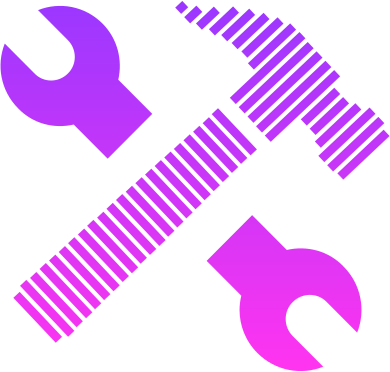

  
  
A handy toolset for every ethereum developer

  

    <strong>💸 Enjoy using DethTools? Consider funding development via <a href="https://gitcoin.co/grants/4038/deth-typechain">GitCoin</a> 💸</strong>
  

# Current tools 🛠

## calculators

- ethereum unit conversion - convert between the most popular ethereum units:
  WEI, GWEI and ETH units with ease. Additionaly, if your input is hex
  formatted, it's gonna be converted automatically to human-readable decimal
  format,
- token unit conversion - enter what decimal base does the value you want to
  convert has (e.g usd coin) and convert between base and unit denomination.

## decoders

- calldata decoder - sometimes we want to know what's sitting inside encoded
  calldata - now getting that information cannot be easier with calldata
  decoder - even without abi, using 4byte signature database,
- event decoder - as above - get information about event from encoded topics.
  You can also use the 4byte option if you don't have access to abi,
- transaction decoder - provide raw, encoded transaction and get decoded output.

## encoders

- constructor encoder - todo - explain it here.

_and many more coming soon.._

# Getting started 📚

## Motivation

The Ethereum world has encountered a lot of minor problems related to the
developer experience. We have to do a lot of conversions, data decoding and
encoding. There are some tools on the web, but they are unorganised and most of
them left unmaitained and in overall poor implementation. We've decided to
change that state with DethTools.

## How does it work?

All you need is to visit the official DethTools website and that's all. Most
proably at some point you may encounter some bugs, unexpected behaviour - report
them to us by creating a PR descibing the problem.

# Ideas 💡

We would love to hear any feedback from our users. If you have any ideas related to the deth-tools - let us know. We want to provide the best dx for average ethereum developer!

# Contributing

Check out our [contributing guidelines](./CONTRIBUTING.md)

# Licence

Kris Kaczor (krzkaczor) MIT | [Github](https://github.com/krzkaczor) |
[Twitter](https://twitter.com/krzkaczor)
